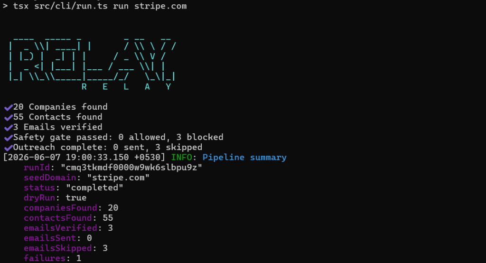
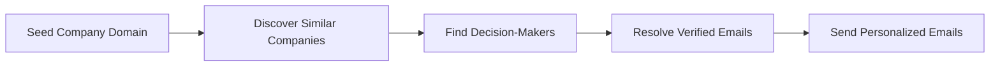

# Relay

An automated, end-to-end cold-outreach CLI  that takes a single seed `company.domain` input and runs a multi-stage outreach campaign autonomously on its lookalike companies.



## Project Description

This is Relay, an automated cold-outreach assistant that automates the process of finding lookalike companies, identifying key decision-makers, resolving contact details, validating safety and cooldown rules, and dispatching personalized outbound emails:



1. **Discover Similar Companies**: Finds companies that are similar to a given target company.
2. **Find Decision-Makers**: Identifies senior people (such as executives and managers) working at those discovered companies.
3. **Resolve Verified Emails**: Searches for and validates the professional email addresses of those contacts.
4. **Send Personalized Emails**: Generates custom email copies tailored to each recipient and dispatches them automatically.

---

## Getting Started

### Prerequisites
- Node.js 20+
- SQLite3

### Setup & Installation

1. **Install dependencies**:
   ```bash
   npm install
   ```

2. **Configure your environment**:
   Copy `.env.example` to `.env` and fill in your API credentials:
   ```bash
   cp .env.example .env
   ```

3. **Initialize the Database**:
   Set up your SQLite schema using Prisma:
   ```bash
   npm run prisma:generate
   ```
   Apply the database schema directly to your local file:
   ```bash
   npm run prisma:push
   ```

4. **Verify setup**:
   Compile the TypeScript code and execute tests to ensure a clean setup:
   ```bash
   npm run build
   # Run Vitest test suite
   npm test
   ```

---

## CLI Usage Reference

### Primary Command
To run the full outreach pipeline with all stages active:
```bash
npm run relay -- run <company.domain>
```

### CLI Flags (Options)
Modify pipeline behavior by passing the following flags after the `--` separator:

| Flag | Description |
|---|---|
| `--live` | Sends real outreach emails to discovered contacts. If omitted, the pipeline runs in simulation mode, displaying the progress on the CLI but redirecting emails to `shryansh2024@gmail.com`. |
| `--no-cache` | Disables reading cached lookups (companies, contacts, and emails) from previous completed runs. It forces fresh API lookups and stores the new data in the database. |

*Example:* Run the pipeline for `stripe.com` in live mode, disabling lookups from previous run database cache:
```bash
npm run relay -- run stripe.com --live --no-cache
```
