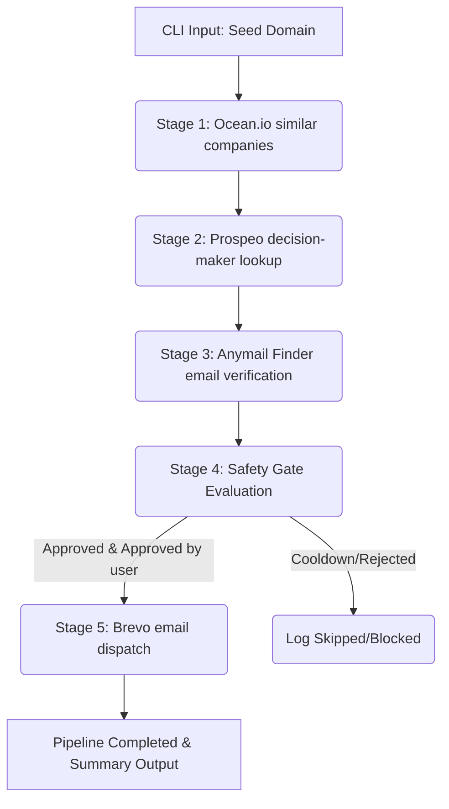
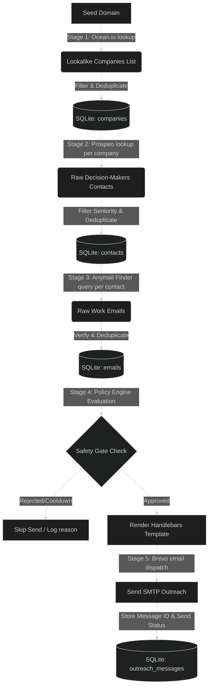
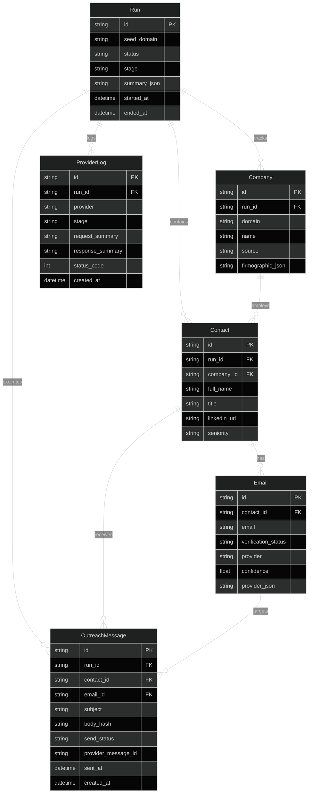

# Relay: Cold-Outreach Pipeline Architectural Breakdown

Relay is a structured, production-ready TypeScript cold-outreach automation pipeline designed to run via a CLI. It orchestrates company discovery, decision-maker extraction, email verification, safety evaluation, and email dispatch using a robust local database caching layer, rate limiting, and progress recovery.

---

## 🏢 System Architecture & Workflow



### 🔄 Data Flow Diagram

The diagram below maps the complete data flow, including API integration boundaries and persistence points inside the local database:



### Component Structure

The codebase is modular, separating execution logic, database management, external integrations, and templates:

* **Entrypoint**: `src/cli/run.ts` handles arguments, creates dependencies, prints beautiful summary metrics, and manages clean shutdown.
* **Orchestrator**: `src/orchestrator/pipeline.ts` runs the stages sequentially, manages transaction logs, and runs the interactive TTY loop.
* **Safety Gate**: `src/safety/policy-engine.ts` decides whether to allow, reject, or abort sending based on constraints.
* **Providers**: `src/providers/` maps third-party APIs (Ocean.io, Prospeo, Anymail Finder, Brevo) with dedicated clients implementing rate limiting and error handling.
* **Repositories**: `src/db/repositories.ts` handles standard Prisma database reads and writes.

---

## 🗄️ Database Schema & Relationships

Relay uses a local SQLite database managed via Prisma ORM. It tracks execution status, caches external API responses to avoid duplicate billing, logs errors, and runs policy checks.

The entity relationship diagram below details the schema structure and foreign key associations:



### Table Definitions & Roles
1. **`runs`**: Tracks execution checkpoints (`started`, `ocean_io`, `prospeo`, `anymailfinder`, `brevo`, `completed`, `failed`), allowing the CLI to safely resume interrupted runs.
2. **`companies`**: Caches lookalike company records discovered via Ocean.io to bypass lookup charges on subsequent run executions.
3. **`contacts`**: Stores extracted senior decision-makers associated with lookalike companies from Prospeo.
4. **`emails`**: Caches email search results and provider confidence scores to prevent duplicate validation credits spending.
5. **`outreach_messages`**: Maintains a complete record of outreach activity, preventing multi-contact spam, enforcing recontact cooldown policies, and archiving Brevo dispatch details.
6. **`provider_logs`**: Serves as a diagnostic audit trail tracking exact request payloads, responses, and HTTP status codes for every outbound API call.

---

## 🛠 Core Features & Components

### 1. Auto-Resume & Progress Recovery
* **How it works**: The pipeline checks the database for any active or failed run for the input domain. If a prior run was left incomplete, it detects progress by inspecting counts of saved entities (`Company`, `Contact`, `Email`, `OutreachMessage`) and resumes from the exact stage that failed.
* **State Management**:
  | Saved Entities | Detected Progress Stage | Resumes From |
  | :--- | :--- | :--- |
  | No entities | `started` | Stage 1 (Ocean.io) |
  | Companies > 0 | `ocean_io` | Stage 2 (Prospeo) |
  | Contacts > 0 | `prospeo` | Stage 3 (Anymail Finder) |
  | Emails > 0 | `anymailfinder` | Stage 4 (Safety Gate) |

### 2. Database Caching Layer
* **How it works**: Before executing any third-party HTTP call, the repositories lookup previous completed runs. If matching lookalike companies, decision-maker contacts, or verified emails already exist in the database, the API calls are skipped.
* **Control**: Can be forced to bypass cache using the `--no-cache` flag.

### 3. Safety Gate & Cooldown Policy
* **Enforcements**:
  * **Recontact Cooldown**: Queries the database to verify if a contact has been emailed within the configured `RECONTACT_COOLDOWN_DAYS` (default: 30).
  * **Run Caps**: Caps total outbound email candidates to `MAX_SENDS_PER_RUN`. If the list exceeds this, the safety gate aborts.
  * **Content Integrity**: Discards any email with missing headers or empty templates.

### 4. Interactive Review & Simulation (Dry-Run)
* **Preview Gate**: Displays a sample rendered email and requires manual confirmation (`Y/n`) before outbound dispatch when run interactively.
* **Simulation (Dry-Run)**: In simulation mode (`--live` is omitted), the dispatcher mocks messages, writes `dry_run` status records, and forwards one single sample email to `shryansh2024@gmail.com` to inspect real formatting.

---

## 🔌 Stage Request/Response Specifications

Each integration provider uses strict payloads. Below are the exact HTTP request headers, body schemas, and response formats implemented across the pipeline stages:

### Stage 1: Ocean.io (Company Similarity Search)
* **Purpose**: Discovers lookalike companies for a given seed domain.
* **HTTP Method**: `POST`
* **Target Endpoint**: `https://api.ocean.io/v3/search/companies`
* **Request Headers**:
  ```http
  x-api-token: <OCEAN_IO_API_KEY>
  Content-Type: application/json
  ```
* **Request Body Schema**:
  ```json
  {
    "size": 20,
    "companiesFilters": {
      "lookalikeDomains": ["seeddomain.com"]
    }
  }
  ```
* **Response Payload Structure**:
  ```json
  {
    "companies": [
      {
        "company": {
          "name": "Lookalike Corp",
          "domain": "lookalikecorp.com",
          "website": "https://lookalikecorp.com",
          "rootUrl": "lookalikecorp.com"
        }
      }
    ]
  }
  ```

---

### Stage 2: Prospeo (Decision-Maker Discovery)
* **Purpose**: Extracts senior contacts (e.g. Founder/Owner, C-Suite, VP, Director, Head) matching the lookalike domains.
* **HTTP Method**: `POST`
* **Target Endpoint**: `https://api.prospeo.io/search-person`
* **Request Headers**:
  ```http
  X-KEY: <PROSPEO_API_KEY>
  Content-Type: application/json
  ```
* **Request Body Schema**:
  ```json
  {
    "page": 1,
    "filters": {
      "company": {
        "websites": {
          "include": ["lookalikecorp.com"]
        }
      },
      "person_seniority": {
        "include": ["Founder/Owner", "C-Suite", "Vice President", "Director", "Head"]
      }
    }
  }
  ```
* **Response Payload Structure**:
  ```json
  {
    "results": [
      {
        "person": {
          "full_name": "Jane Doe",
          "first_name": "Jane",
          "last_name": "Doe",
          "job_title": "Vice President of Growth",
          "linkedin_url": "https://linkedin.com/in/janedoe",
          "seniority": "Vice President"
        },
        "company": {
          "name": "Lookalike Corp",
          "domain": "lookalikecorp.com"
        }
      }
    ]
  }
  ```

---

### Stage 3: Anymail Finder (Email Search & Verification)
* **Purpose**: Finds and validates work emails using the prospect's LinkedIn profile.
* **HTTP Method**: `POST`
* **Target Endpoint**: `https://api.anymailfinder.com/v5.1/find-email/linkedin-url`
* **Request Headers**:
  ```http
  Authorization: <ANYMAIL_FINDER_API_KEY>
  Content-Type: application/json
  ```
* **Request Body Schema**:
  ```json
  {
    "linkedin_url": "https://linkedin.com/in/janedoe"
  }
  ```
* **Response Payload Structure**:
  ```json
  {
    "credits_charged": 1,
    "email": "jane.doe@lookalikecorp.com",
    "email_status": "valid",
    "person_company_name": "Lookalike Corp",
    "person_full_name": "Jane Doe",
    "person_job_title": "Vice President of Growth",
    "valid_email": "jane.doe@lookalikecorp.com"
  }
  ```

---

### Stage 5: Brevo (Outbound Email Dispatch)
* **Purpose**: Dispatches the rendered personal cold email.
* **HTTP Method**: `POST`
* **Target Endpoint**: `https://api.brevo.com/v3/smtp/email`
* **Request Headers**:
  ```http
  api-key: <BREVO_API_KEY>
  Content-Type: application/json
  ```
* **Request Body Schema**:
  ```json
  {
    "sender": {
      "email": "sender@yourdomain.com",
      "name": "Outreach Team"
    },
    "to": [
      {
        "email": "jane.doe@lookalikecorp.com",
        "name": "Jane Doe"
      }
    ],
    "subject": "Tailored subject line",
    "htmlContent": "HTML-rendered body copy <br> content",
    "textContent": "Plain-text fallback body copy content",
    "tags": ["outreach-run-cuid"]
  }
  ```
* **Response Payload Structure**:
  ```json
  {
    "messageId": "<unique-brevo-message-id>"
  }
  ```